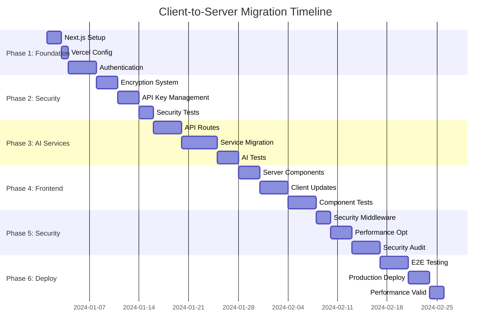

# Client-to-Server Migration Plan: React SPA → Next.js + Vercel

## Executive Summary

This plan transforms the current **client-side React SPA** with browser-based AI provider calls into a **secure server-side Next.js application** on Vercel. The migration preserves all existing UI/UX while moving sensitive operations server-side and implementing proper user authentication.

**Migration Scope**: 18 AI models across 5 providers, 230 existing tests, comprehensive dark-theme UI, and production-ready security system.

---

## Current State Analysis

### Existing Tech Stack
- **React 19.1.0** with **TypeScript 5.8.3**
- **Vite 6.3.5** as build tool with React plugin
- **Tailwind CSS 4.1.10** for styling
- **Vercel AI SDK v4.3.16** with provider-specific SDKs
- **230 passing tests** across security, components, and AI services

### Current Architecture (Client-Side)
- Direct browser API calls to AI providers (OpenAI, Anthropic, Google, Mistral, Together)
- Web Crypto API for client-side API key encryption
- Static deployment to GitHub Pages
- No server-side components or authentication

### Target Architecture (Server-Side)
- Next.js 15 with App Router on Vercel
- Clerk authentication with OAuth providers
- Server-side AI provider calls via Next.js API routes
- User-specific encryption with Vercel KV storage
- Zero client-side API key exposure

---

## Phase 1: Project Foundation & Infrastructure

### Task 1.1: Initialize Next.js Project Structure
**Duration**: 2 hours  
**Priority**: High  
**Dependencies**: None

**Deliverables**:
- Convert Vite React project to Next.js 15 with App Router
- Migrate TypeScript configuration for Next.js
- Update build scripts and deployment configuration
- Preserve existing ESLint/Prettier configuration

**Steps**:
1. Install Next.js 15 with App Router: `npx create-next-app@latest --typescript --tailwind --app`
2. Copy existing components from `src/components/` to `app/components/`
3. Migrate `vite.config.ts` settings to `next.config.ts`
4. Update `tsconfig.json` for Next.js App Router patterns
5. Update package.json scripts for Next.js development

**Acceptance Criteria**:
- `npm run dev` starts Next.js development server
- All existing TypeScript types compile without errors
- Tailwind CSS configuration migrated and working
- Source maps and hot reload functioning

**Technical Notes**:
- Use `create-next-app` with TypeScript template as reference
- Preserve existing strict TypeScript configuration
- Maintain current component structure and naming

### Task 1.2: Configure Vercel Deployment Environment
**Duration**: 1 hour  
**Priority**: High  
**Dependencies**: Task 1.1

**Deliverables**:
- Vercel project configuration with environment variables
- GitHub integration with automatic deployments
- Vercel KV database setup for secure key storage
- Domain configuration and SSL setup

**Steps**:
1. Connect GitHub repository to Vercel
2. Configure environment variables in Vercel dashboard
3. Setup Vercel KV instance for encrypted storage
4. Configure custom domain and SSL certificates
5. Test deployment pipeline with preview environments

**Environment Variables Required**:
```
# Master key for deriving user-specific keys
MASTER_ENCRYPTION_KEY=your-very-long-random-key # openssl rand -hex 64

# Vercel KV
KV_URL=...
KV_REST_API_URL=...
KV_REST_API_TOKEN=...

# Clerk Auth
NEXT_PUBLIC_CLERK_PUBLISHABLE_KEY=...
CLERK_SECRET_KEY=...
```

**Acceptance Criteria**:
- Successful deployment to Vercel with custom domain
- Environment variables properly configured and accessible
- Vercel KV instance operational and accessible
- Build pipeline functioning with zero downtime deployments

### Task 1.3: Implement User Authentication System
**Duration**: 4 hours  
**Priority**: High  
**Dependencies**: Task 1.2

**Deliverables**:
- Clerk authentication integration with Vercel
- User registration/login flows with OAuth providers
- Authentication middleware for protected routes
- User session management and token handling

**Steps**:
1. Install and configure Clerk: `npm install @clerk/nextjs`
2. Setup OAuth applications for GitHub and Google
3. Create `middleware.ts` for route protection
4. Implement authentication components and layouts
5. Configure Clerk webhook integration for user lifecycle events

**File Structure**:
```
app/
├── sign-in/[[...sign-in]]/page.tsx
├── sign-up/[[...sign-up]]/page.tsx
├── layout.tsx (with ClerkProvider)
└── middleware.ts
```

**Acceptance Criteria**:
- Users can sign up/sign in via GitHub and Google OAuth
- Protected routes redirect unauthenticated users to login
- User sessions persist across browser sessions
- Clerk webhook integration for user lifecycle events

**Technical Notes**:
- Follow Clerk + Vercel integration best practices
- Configure OAuth applications with proper redirect URIs
- Setup user metadata storage in Clerk

---

## Phase 2: Server-Side Security Infrastructure

### Task 2.1: Build User-Specific Encryption System
**Duration**: 3 hours  
**Priority**: High  
**Dependencies**: Task 1.3

**Deliverables**:
- Server-side crypto utilities with user-specific key derivation
- PBKDF2-based key generation using user ID + master secret
- AES-256-GCM encryption/decryption functions
- Secure key rotation mechanism

**Implementation**:
```typescript
// lib/user-crypto.ts
import { createCipheriv, createDecipheriv, randomBytes, pbkdf2Sync } from 'crypto';

const algorithm = 'aes-256-gcm';

// Derive a unique encryption key for each user
function deriveUserKey(userId: string): Buffer {
  const serverSecret = process.env.MASTER_ENCRYPTION_KEY!;
  
  // Use PBKDF2 to derive a user-specific key
  return pbkdf2Sync(
    userId,
    serverSecret,
    100000, // iterations
    32,     // key length
    'sha256'
  );
}

export async function encryptForUser(userId: string, text: string): Promise<string> {
  const key = deriveUserKey(userId);
  const iv = randomBytes(16);
  const cipher = createCipheriv(algorithm, key, iv);
  
  let encrypted = cipher.update(text, 'utf8', 'hex');
  encrypted += cipher.final('hex');
  
  const authTag = cipher.getAuthTag();
  
  // Format: iv:authTag:encrypted
  return `${iv.toString('hex')}:${authTag.toString('hex')}:${encrypted}`;
}

export async function decryptForUser(userId: string, encryptedData: string): Promise<string> {
  const key = deriveUserKey(userId);
  const [ivHex, authTagHex, encrypted] = encryptedData.split(':');
  
  const iv = Buffer.from(ivHex, 'hex');
  const authTag = Buffer.from(authTagHex, 'hex');
  
  const decipher = createDecipheriv(algorithm, key, iv);
  decipher.setAuthTag(authTag);
  
  let decrypted = decipher.update(encrypted, 'hex', 'utf8');
  decrypted += decipher.final('utf8');
  
  return decrypted;
}
```

**Acceptance Criteria**:
- Each user gets unique encryption keys derived from their user ID
- API keys encrypted with user-specific keys only
- Master key rotation doesn't break existing encrypted data
- Cryptographic operations are constant-time and secure

**Technical Notes**:
- Use Node.js `crypto` module for server-side operations
- Implement PBKDF2 with 100,000 iterations minimum
- Follow OWASP cryptographic storage guidelines

### Task 2.2: Create Secure API Key Management System
**Duration**: 3 hours  
**Priority**: High  
**Dependencies**: Task 2.1

**Deliverables**:
- `SecureApiKeys` service class for CRUD operations
- Vercel KV integration with user-namespaced storage
- API key validation and health check endpoints
- Error handling and audit logging

**Implementation**:
```typescript
// lib/api-keys.ts
import { auth } from '@clerk/nextjs';
import { kv } from '@vercel/kv';
import { encryptForUser, decryptForUser } from './user-crypto';

export class SecureApiKeys {
  static async store(provider: string, apiKey: string) {
    const { userId } = auth();
    if (!userId) throw new Error('Not authenticated');
    
    const encrypted = await encryptForUser(userId, apiKey);
    await kv.hset(`user:${userId}:keys`, provider, encrypted);
  }

  static async retrieve(provider: string): Promise<string | null> {
    const { userId } = auth();
    if (!userId) throw new Error('Not authenticated');
    
    const encrypted = await kv.hget(`user:${userId}:keys`, provider) as string;
    if (!encrypted) return null;
    
    return decryptForUser(userId, encrypted);
  }

  static async remove(provider: string) {
    const { userId } = auth();
    if (!userId) throw new Error('Not authenticated');
    
    await kv.hdel(`user:${userId}:keys`, provider);
  }

  static async hasKey(provider: string): Promise<boolean> {
    const { userId } = auth();
    if (!userId) return false;
    
    return await kv.hexists(`user:${userId}:keys`, provider);
  }
}
```

**API Endpoints**:
```
POST /api/keys/store - Store encrypted API key
GET /api/keys/[provider] - Retrieve user's API key status
DELETE /api/keys/[provider] - Remove API key
POST /api/keys/validate/[provider] - Validate API key with provider
```

**Acceptance Criteria**:
- API keys stored encrypted per-user in Vercel KV
- Only authenticated users can access their own keys
- Failed decryption attempts are logged and monitored
- Keys can be rotated without breaking existing functionality

**Technical Notes**:
- Namespace keys in KV as `user:${userId}:keys:${provider}`
- Implement key versioning for rotation scenarios
- Add audit trail for security compliance

### Task 2.3: Migrate Security Tests to Server Environment
**Duration**: 2 hours  
**Priority**: Medium  
**Dependencies**: Task 2.2

**Deliverables**:
- Convert existing crypto tests from Web Crypto API to Node.js crypto
- Integration tests for user-specific encryption
- API endpoint tests for key management operations
- Performance tests for encryption/decryption operations

**Test Structure**:
```
src/lib/__tests__/
├── user-crypto.test.ts - Server-side encryption tests
├── api-keys.test.ts - API key management tests
└── integration/
    ├── auth-flow.test.ts - Authentication integration
    └── key-isolation.test.ts - User boundary tests
```

**Acceptance Criteria**:
- All 45 existing security tests pass with server-side crypto
- New tests cover user isolation and key derivation
- Performance benchmarks meet acceptable thresholds
- Security tests run in CI/CD pipeline

**Technical Notes**:
- Mock Clerk authentication in test environment
- Use test database for KV operations
- Maintain existing test patterns and coverage

---

## Phase 3: AI Service Server Migration

### Task 3.1: Create Next.js API Routes for AI Providers
**Duration**: 4 hours  
**Priority**: High  
**Dependencies**: Task 2.2

**Deliverables**:
- API routes for each AI provider (`/api/ai/[provider]/route.ts`)
- Server-side Vercel AI SDK integration
- Request/response transformation layers
- Rate limiting and usage monitoring

**API Route Structure**:
```
app/api/ai/
├── openai/route.ts
├── anthropic/route.ts
├── google/route.ts
├── mistral/route.ts
├── together/route.ts
└── generate/route.ts (unified endpoint)
```

**Implementation Example**:
```typescript
// app/api/ai/generate/route.ts
import { auth } from '@clerk/nextjs';
import { kv } from '@vercel/kv';
import { decryptForUser } from '@/lib/user-crypto';
import { openai } from '@ai-sdk/openai';
import { streamText } from 'ai';

export async function POST(req: Request) {
  const { userId } = auth();
  if (!userId) {
    return new Response('Unauthorized', { status: 401 });
  }

  const { messages, model, provider } = await req.json();

  // Get user's encrypted API key
  const encryptedKey = await kv.hget(`user:${userId}:keys`, provider) as string;
  
  if (!encryptedKey) {
    return new Response('API key not configured', { status: 400 });
  }

  // Decrypt with user-specific key
  const apiKey = await decryptForUser(userId, encryptedKey);

  // Use the API key server-side only
  const result = await streamText({
    model: openai(model, { apiKey }),
    messages,
  });

  return result.toTextStreamResponse();
}
```

**Acceptance Criteria**:
- All 5 AI providers accessible via server-side API routes
- Streaming responses working with Vercel AI SDK
- Request validation and sanitization implemented
- Error handling with appropriate HTTP status codes

**Technical Notes**:
- Use dynamic routes for provider switching
- Implement streaming with `streamText` from AI SDK
- Add request validation middleware
- Configure timeout handling for long AI requests

### Task 3.2: Migrate AI Service Logic to Server-Side
**Duration**: 5 hours  
**Priority**: High  
**Dependencies**: Task 3.1

**Deliverables**:
- Server-side `AIService` class with provider management
- Model configuration and validation system
- Multi-response generation with temperature variations
- Probability calculation and ranking algorithms

**Server-Side Service Structure**:
```typescript
// lib/ai-service.ts
export class ServerAIService {
  private providers: Map<string, AIProvider>;
  
  async generateSingleResponse(userId: string, options: GenerationOptions) {
    const apiKey = await SecureApiKeys.retrieve(options.provider);
    // Generate single response server-side
  }
  
  async generateVariations(userId: string, options: VariationOptions) {
    // Generate multiple responses with temperature variations
  }
  
  async generateMultiModelResponses(userId: string, options: MultiModelOptions) {
    // Parallel generation across multiple providers
  }
  
  async validateApiKey(userId: string, provider: string, apiKey: string) {
    // Server-side API key validation
  }
}
```

**Migration Steps**:
1. Copy existing AI service interfaces to server-side
2. Update provider implementations for server-side execution
3. Migrate model configurations and capabilities
4. Implement server-side streaming response handling
5. Add server-side caching for repeated requests

**Acceptance Criteria**:
- All 18 AI models accessible from server-side service
- Temperature variations generate multiple responses
- Cross-provider parallel generation working
- Logprobs and probability calculations preserved

**Technical Notes**:
- Preserve existing provider interface pattern
- Implement server-side streaming for real-time responses
- Add connection pooling for provider API calls
- Maintain existing response format for UI compatibility

### Task 3.3: Update AI Service Tests for Server Environment
**Duration**: 3 hours  
**Priority**: Medium  
**Dependencies**: Task 3.2

**Deliverables**:
- Convert existing AI service tests to API route tests
- Mock provider responses for testing
- Integration tests for multi-provider scenarios
- Performance tests for concurrent generation

**Test Migration**:
```
src/services/ai/__tests__/ → app/api/ai/__tests__/
├── providers/
│   ├── openai.test.ts → openai/route.test.ts
│   ├── anthropic.test.ts → anthropic/route.test.ts
│   └── ... (other providers)
├── AIService.test.ts → generate/route.test.ts
└── integration/
    ├── multi-provider.test.ts
    └── streaming.test.ts
```

**Acceptance Criteria**:
- All existing AI service test scenarios pass
- New tests cover server-specific error handling
- Mock responses maintain realistic timing and formats
- Load testing validates concurrent user scenarios

**Technical Notes**:
- Use `@vercel/node` testing utilities
- Mock external AI provider APIs consistently
- Test streaming response handling
- Validate memory usage under load

---

## Phase 4: Frontend Migration & API Integration

### Task 4.1: Convert Components to Server Components Where Appropriate
**Duration**: 3 hours  
**Priority**: Medium  
**Dependencies**: Phase 3 completion

**Deliverables**:
- Migrate `ChatContainer` to Server Component with data fetching
- Update `Settings` component for server-side key management
- Preserve client components for interactive features
- Implement proper data fetching patterns

**Component Architecture**:
```
app/
├── chat/page.tsx (Server Component)
├── settings/page.tsx (Server Component)
└── components/
    ├── ChatContainer.tsx (Server Component)
    ├── Message.tsx (Client Component)
    ├── MessageInput.tsx (Client Component)
    └── Settings.tsx (Hybrid - Server + Client)
```

**Server Component Example**:
```typescript
// app/chat/page.tsx
import { SecureApiKeys } from '@/lib/api-keys';

export default async function ChatPage() {
  const hasOpenAI = await SecureApiKeys.hasKey('openai');
  const hasAnthropic = await SecureApiKeys.hasKey('anthropic');
  
  return (
    <div>
      {!hasOpenAI && (
        <Alert>Please configure your OpenAI API key in settings</Alert>
      )}
      <ChatContainer 
        enabledProviders={{
          openai: hasOpenAI,
          anthropic: hasAnthropic,
        }}
      />
    </div>
  );
}
```

**Acceptance Criteria**:
- Server components render with initial data from server
- Client components handle user interactions smoothly
- No layout shift during hydration
- SEO and performance benefits from server rendering

**Technical Notes**:
- Use `app/` directory Server Component patterns
- Implement `loading.tsx` and `error.tsx` boundaries
- Preserve existing component APIs for minimal migration
- Use React Server Components for authentication state

### Task 4.2: Update Client-Side AI Service Calls
**Duration**: 4 hours  
**Priority**: High  
**Dependencies**: Task 4.1

**Deliverables**:
- Replace direct AI provider calls with Next.js API routes
- Update `usePossibilities` hook for server-side generation
- Implement proper error handling and loading states
- Preserve existing streaming response handling

**Client-Side Service Update**:
```typescript
// hooks/usePossibilities.ts (Updated)
export function usePossibilities() {
  const generateResponse = async (options: GenerationOptions) => {
    // Replace direct provider calls with API routes
    const response = await fetch('/api/ai/generate', {
      method: 'POST',
      headers: { 'Content-Type': 'application/json' },
      body: JSON.stringify(options),
    });
    
    if (!response.ok) {
      throw new Error('Generation failed');
    }
    
    // Handle streaming response
    return response.body;
  };
  
  // Rest of hook logic preserved
}
```

**Migration Steps**:
1. Update all AI service calls to use API routes
2. Implement proper error handling for server responses
3. Update streaming response handling for server-side streams
4. Add loading states and retry logic
5. Update TypeScript types for API responses

**Acceptance Criteria**:
- All AI generation flows work through server-side APIs
- Streaming responses maintain real-time user experience
- Error states properly handled and displayed to users
- Loading indicators work correctly during generation

**Technical Notes**:
- Use `fetch` API for server-side route calls
- Implement retry logic for failed requests
- Preserve existing response streaming patterns
- Add proper TypeScript types for API responses

### Task 4.3: Migrate Component Tests to Next.js Environment
**Duration**: 4 hours  
**Priority**: Medium  
**Dependencies**: Task 4.2

**Deliverables**:
- Update existing component tests for Next.js environment
- Add tests for Server Component behavior
- Integration tests for client-server communication
- Mock API route responses in component tests

**Test Configuration**:
```typescript
// vitest.config.ts (Updated for Next.js)
import { defineConfig } from 'vitest/config';
import react from '@vitejs/plugin-react';

export default defineConfig({
  plugins: [react()],
  test: {
    environment: 'jsdom',
    setupFiles: ['./src/setupTests.ts'],
    globals: true,
  },
  resolve: {
    alias: {
      '@': path.resolve(__dirname, './'),
    },
  },
});
```

**Mock Updates**:
```typescript
// setupTests.ts (Updated)
import { vi } from 'vitest';

// Mock Next.js router
vi.mock('next/navigation', () => ({
  useRouter: () => ({
    push: vi.fn(),
    refresh: vi.fn(),
  }),
}));

// Mock Clerk authentication
vi.mock('@clerk/nextjs', () => ({
  auth: () => ({ userId: 'test-user-id' }),
  useAuth: () => ({ userId: 'test-user-id', isLoaded: true }),
}));

// Mock API routes
global.fetch = vi.fn();
```

**Acceptance Criteria**:
- All 63 existing component tests pass in Next.js environment
- New tests cover server-side rendering scenarios
- API route mocking works correctly in test environment
- Component integration tests validate full user flows

**Technical Notes**:
- Configure Vitest for Next.js testing
- Mock Next.js router and authentication
- Update test utilities for Server Components
- Maintain existing test coverage metrics

---

## Phase 5: Security & Performance Optimization

### Task 5.1: Implement Security Middleware and Headers
**Duration**: 2 hours  
**Priority**: High  
**Dependencies**: Phase 4 completion

**Deliverables**:
- Security headers configuration (CSP, HSTS, etc.)
- Rate limiting middleware for API routes
- Request validation and sanitization
- CORS configuration for production

**Security Configuration**:
```typescript
// next.config.js
const nextConfig = {
  async headers() {
    return [
      {
        source: '/(.*)',
        headers: [
          {
            key: 'X-Frame-Options',
            value: 'DENY',
          },
          {
            key: 'X-Content-Type-Options',
            value: 'nosniff',
          },
          {
            key: 'Referrer-Policy',
            value: 'origin-when-cross-origin',
          },
          {
            key: 'Content-Security-Policy',
            value: "default-src 'self'; script-src 'self' 'unsafe-eval'; style-src 'self' 'unsafe-inline';",
          },
        ],
      },
    ];
  },
};
```

**Rate Limiting Middleware**:
```typescript
// middleware.ts (Enhanced)
import { Ratelimit } from '@upstash/ratelimit';
import { kv } from '@vercel/kv';

const ratelimit = new Ratelimit({
  redis: kv,
  limiter: Ratelimit.slidingWindow(10, '10 s'),
});

export async function middleware(request: NextRequest) {
  // Authentication check
  const { userId } = auth();
  
  // Rate limiting for API routes
  if (request.nextUrl.pathname.startsWith('/api/')) {
    const identifier = userId || request.ip || 'anonymous';
    const { success } = await ratelimit.limit(identifier);
    
    if (!success) {
      return new Response('Rate limit exceeded', { status: 429 });
    }
  }
  
  return NextResponse.next();
}
```

**Acceptance Criteria**:
- Security headers score A+ on security scanning tools
- Rate limiting prevents abuse without affecting normal usage
- Input validation blocks malicious requests
- CORS properly configured for production domain

**Technical Notes**:
- Use `next.config.js` for security headers
- Implement rate limiting with `@upstash/ratelimit`
- Add input validation with Zod schemas
- Configure CSP for AI provider domains

### Task 5.2: Optimize Performance and Caching
**Duration**: 3 hours  
**Priority**: Medium  
**Dependencies**: Task 5.1

**Deliverables**:
- Server-side caching for AI responses
- CDN configuration for static assets
- Database query optimization for key storage
- Performance monitoring and analytics

**Caching Strategy**:
```typescript
// lib/cache.ts
import { kv } from '@vercel/kv';

export class ResponseCache {
  static async get(key: string): Promise<string | null> {
    return await kv.get(`cache:${key}`);
  }
  
  static async set(key: string, value: string, ttl: number = 3600) {
    await kv.setex(`cache:${key}`, ttl, value);
  }
  
  static generateKey(messages: Message[], model: string, temperature: number): string {
    // Generate cache key from request parameters
    const content = messages.map(m => m.content).join('|');
    return `${model}:${temperature}:${hashString(content)}`;
  }
}
```

**Performance Optimizations**:
- Implement Redis caching for AI responses
- Use Vercel Edge Caching for static content
- Optimize database queries with proper indexing
- Add performance monitoring with Vercel Analytics

**Acceptance Criteria**:
- Page load times under 2 seconds
- AI response caching reduces redundant provider calls
- Static assets cached efficiently with proper TTL
- Performance metrics tracked in production

**Technical Notes**:
- Use Vercel Edge Caching for API responses
- Implement Redis caching for frequent requests
- Configure Vercel Analytics and monitoring
- Add performance budgets to CI/CD pipeline

### Task 5.3: Security Audit and Penetration Testing
**Duration**: 4 hours  
**Priority**: High  
**Dependencies**: Task 5.2

**Deliverables**:
- Comprehensive security audit of authentication flows
- Penetration testing of API key management system
- Vulnerability scanning of all endpoints
- Security documentation and incident response plan

**Security Testing Checklist**:
- [ ] Authentication bypass attempts
- [ ] API key encryption validation
- [ ] Rate limiting effectiveness
- [ ] Input validation and XSS prevention
- [ ] CSRF protection verification
- [ ] Database injection testing
- [ ] Session management security
- [ ] Error message information disclosure

**Security Documentation**:
```
docs/security/
├── architecture.md - Security architecture overview
├── threat-model.md - Threat modeling and risk assessment
├── incident-response.md - Security incident procedures
└── audit-results.md - Security audit findings
```

**Acceptance Criteria**:
- No critical or high-severity vulnerabilities found
- Authentication bypass attempts fail
- Encrypted data remains secure under attack scenarios
- Incident response procedures documented and tested

**Technical Notes**:
- Use automated security scanning tools
- Test for OWASP Top 10 vulnerabilities
- Verify encryption implementation against standards
- Document security architecture decisions

---

## Phase 6: Testing & Deployment

### Task 6.1: End-to-End Testing Suite
**Duration**: 4 hours  
**Priority**: High  
**Dependencies**: Phase 5 completion

**Deliverables**:
- Playwright E2E tests for complete user journeys
- Multi-browser testing automation
- Mobile responsiveness validation
- Accessibility testing compliance

**E2E Test Structure**:
```
tests/e2e/
├── auth/
│   ├── signup.spec.ts
│   ├── signin.spec.ts
│   └── logout.spec.ts
├── chat/
│   ├── message-flow.spec.ts
│   ├── file-upload.spec.ts
│   └── multi-response.spec.ts
├── settings/
│   ├── api-key-management.spec.ts
│   └── preferences.spec.ts
└── mobile/
    ├── responsive.spec.ts
    └── touch-interactions.spec.ts
```

**Test Scenarios**:
1. User registration and authentication flow
2. API key configuration and validation
3. Message sending and AI response generation
4. File upload and attachment handling
5. Multi-response generation and selection
6. Mobile responsiveness and touch interactions

**Acceptance Criteria**:
- Complete user flows tested from registration to AI generation
- Tests pass consistently across Chrome, Firefox, Safari
- Mobile experience validated on iOS and Android
- WCAG 2.1 AA compliance verified

**Technical Notes**:
- Use Playwright for cross-browser testing
- Test real AI provider integrations in staging
- Validate responsive design across device sizes
- Add visual regression testing for UI changes

### Task 6.2: Production Deployment and Monitoring
**Duration**: 3 hours  
**Priority**: High  
**Dependencies**: Task 6.1

**Deliverables**:
- Production deployment with zero-downtime strategy
- Monitoring and alerting system setup
- Error tracking and performance monitoring
- Database backup and disaster recovery procedures

**Monitoring Setup**:
```typescript
// lib/monitoring.ts
import { track } from '@vercel/analytics';
import * as Sentry from '@sentry/nextjs';

export function trackUserAction(action: string, properties?: Record<string, any>) {
  track(action, properties);
}

export function logError(error: Error, context?: Record<string, any>) {
  Sentry.captureException(error, { extra: context });
}
```

**Deployment Pipeline**:
1. **Staging Deployment**: Automatic deployment of feature branches
2. **Production Deployment**: Manual promotion after testing
3. **Rollback Procedures**: Instant rollback to previous version
4. **Health Checks**: Automated monitoring of critical endpoints

**Acceptance Criteria**:
- Production deployment successful with no service interruption
- Monitoring alerts configured for critical system metrics
- Error tracking captures and reports issues automatically
- Backup procedures tested and recovery time documented

**Technical Notes**:
- Use Vercel's deployment pipeline with preview environments
- Configure Vercel Analytics and custom metrics
- Setup error tracking with Sentry
- Document rollback procedures for emergency scenarios

### Task 6.3: Performance Validation and Optimization
**Duration**: 2 hours  
**Priority**: Medium  
**Dependencies**: Task 6.2

**Deliverables**:
- Load testing with realistic user scenarios
- Performance benchmarking and optimization
- CDN configuration validation
- Database performance tuning

**Load Testing Scenarios**:
1. **Concurrent Users**: 100 simultaneous chat sessions
2. **AI Generation**: Multiple responses with streaming
3. **File Uploads**: Large file processing and storage
4. **Database Operations**: API key encryption/decryption at scale

**Performance Targets**:
- Page load time: < 2 seconds
- API response time: < 500ms (cached), < 5s (AI generation)
- Database query time: < 100ms
- CDN hit rate: > 90%

**Acceptance Criteria**:
- System handles 100 concurrent users without degradation
- API response times under 500ms for cached requests
- Database queries optimized for sub-100ms response times
- CDN hit rate above 90% for static assets

**Technical Notes**:
- Use realistic load testing scenarios
- Monitor memory usage and connection pooling
- Optimize database indexes for common queries
- Validate CDN configuration with different geographic locations

---

## Migration Timeline & Dependencies



**Total Duration**: 26 working days (5.2 weeks)  
**Critical Path**: Authentication → Security Infrastructure → AI Migration → Testing  
**Risk Factors**: AI provider API rate limits, encryption performance, test migration complexity

---

## Risk Mitigation & Rollback Strategy

### High-Risk Areas
1. **Encryption Migration**: Client-side to server-side crypto transition
2. **AI Provider Integration**: Maintaining streaming and multi-provider support
3. **Authentication Flow**: User migration and session management
4. **Performance Impact**: Server-side processing vs. client-side execution

### Mitigation Strategies
- **Parallel Development**: Maintain client-side version during migration
- **Feature Flags**: Gradual rollout of server-side features
- **Comprehensive Testing**: 100% test coverage before each phase completion
- **Monitoring**: Real-time performance and error tracking

### Rollback Procedures
- **Database Snapshots**: Before each major migration phase
- **Code Versioning**: Tagged releases for each working milestone
- **Vercel Deployments**: Instant rollback to previous working version
- **User Communication**: Transparent status updates during migrations

---

## Success Metrics & Validation

### Technical Metrics
- **Security**: Zero critical vulnerabilities, all keys encrypted per-user
- **Performance**: <2s page load, <500ms API response times
- **Reliability**: 99.9% uptime, zero data loss during migration
- **Test Coverage**: Maintain 100% of existing test scenarios

### User Experience Metrics
- **Functionality**: All existing features work identically
- **Authentication**: <30s signup flow, persistent sessions
- **AI Generation**: Maintain streaming responses and multi-model support
- **Mobile**: Identical responsive experience

### Business Metrics
- **Cost Optimization**: Reduced client-side compute, efficient server usage
- **Scalability**: Support 10x current user load
- **Security Compliance**: Production-ready for enterprise customers
- **Maintainability**: Reduced security surface area, easier updates

---

## Post-Migration Considerations

### Ongoing Maintenance
- **Dependency Updates**: Regular updates to Next.js, Clerk, and AI SDKs
- **Security Monitoring**: Continuous vulnerability scanning and penetration testing
- **Performance Optimization**: Regular performance audits and optimization
- **User Feedback**: Monitoring user satisfaction and feature requests

### Future Enhancements
- **Advanced Caching**: Implement intelligent response caching
- **Usage Analytics**: Detailed usage tracking and billing integration
- **Enterprise Features**: SSO integration, team management, audit logs
- **API Expansion**: Public API for third-party integrations

### Documentation Updates
- **Developer Onboarding**: Updated setup and contribution guides
- **API Documentation**: Complete API reference for all endpoints
- **Security Procedures**: Updated security practices and incident response
- **Deployment Guide**: Step-by-step deployment and scaling instructions

---

This migration plan provides a comprehensive roadmap for transforming the client-side React SPA into a secure, scalable server-side application while preserving all existing functionality and user experience.