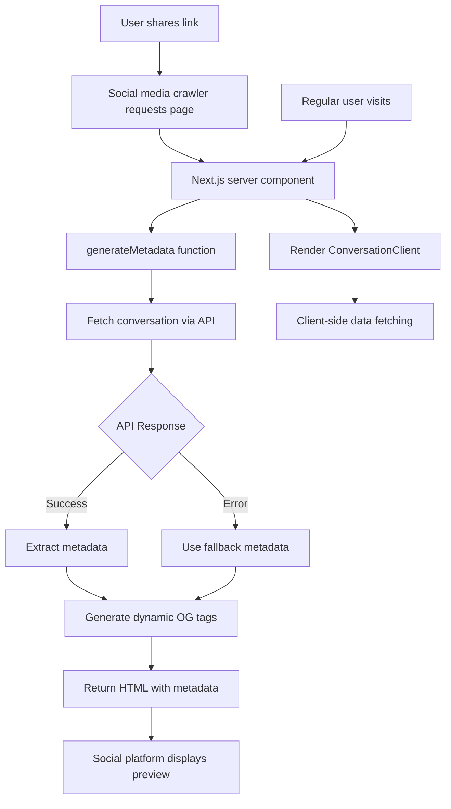

# Dynamic Social Media Preview Design

## Problem Statement

Currently, all shared conversations on chatsbox.ai display the same generic social media preview:
- Title: "chatsbox.ai - Chat Sandbox"
- Description: Generic application description
- No conversation-specific content

This creates a poor user experience when sharing conversations on social media platforms, as the preview doesn't reflect the actual conversation content.

## Requirements

1. **Dynamic Title**: Show the first user message from the conversation
2. **Dynamic Description**: Show the first AI response, including which AI model answered
3. **SEO Optimization**: Ensure proper metadata structure for all major platforms
4. **Performance**: Minimize impact on page load times
5. **Graceful Degradation**: Handle edge cases (missing data, errors) elegantly

## Technical Constraints

1. **Next.js App Router**: Must work with Next.js 13+ App Router patterns
2. **Client Components**: Current conversation page uses `'use client'` directive
3. **Metadata Generation**: Requires server-side rendering for dynamic Open Graph tags
4. **API Availability**: Conversation data is fetched via `/api/conversations/[id]`

## Architecture Design

### 1. Component Structure

```
app/conversation/[id]/
├── page.tsx                 # Server component (new)
├── ConversationClient.tsx   # Client component (refactored from current page.tsx)
└── loading.tsx             # Loading state (optional)
```

### 2. Data Flow



### 3. Implementation Strategy

#### Phase 1: Server Component Wrapper
- Create new `page.tsx` as server component
- Move existing client logic to `ConversationClient.tsx`
- Implement `generateMetadata` function

#### Phase 2: Metadata Generation
- Fetch conversation data server-side
- Extract first user message for title
- Extract first AI response for description
- Include AI model name in description
- Handle multi-model responses

#### Phase 3: Error Handling
- Graceful fallback for missing conversations
- Handle API errors
- Provide meaningful default metadata

### 4. Metadata Structure

```typescript
interface ConversationMetadata {
  title: string              // First user message (truncated to 60 chars)
  description: string        // "ModelName: First 150 chars of response..."
  openGraph: {
    type: 'article'
    title: string
    description: string
    url: string
    siteName: 'chatsbox.ai'
    publishedTime: string
    images?: Array<{        // Future: Generated preview images
      url: string
      width: number
      height: number
      alt: string
    }>
  }
  twitter: {
    card: 'summary_large_image'
    title: string
    description: string
    images?: string[]       // Future: Generated preview images
  }
}
```

### 5. Edge Cases & Solutions

| Edge Case | Solution |
|-----------|----------|
| No user messages | Use "AI Conversation" as title |
| No AI responses | Use "View this conversation on chatsbox.ai" |
| Very long messages | Truncate with ellipsis (title: 60 chars, description: 150 chars) |
| Multiple AI models | Append "Compare responses from N AI models" |
| API timeout | Use static fallback metadata |
| Deleted conversation | Return 404 with appropriate metadata |
| Private conversation | Consider privacy settings (future enhancement) |

### 6. Performance Considerations

1. **Caching Strategy**:
   - Cache metadata for 1 hour using Next.js revalidation
   - Use stale-while-revalidate pattern
   - Consider edge caching for popular conversations

2. **Optimization**:
   - Only fetch minimal data needed for metadata
   - Parallel fetch if additional data needed
   - Use streaming where applicable

### 7. Testing Strategy

1. **Unit Tests**:
   - Metadata generation logic
   - Text truncation functions
   - Error handling scenarios

2. **Integration Tests**:
   - API integration
   - Full metadata generation flow
   - Fallback behavior

3. **Manual Testing**:
   - Facebook Sharing Debugger
   - Twitter Card Validator
   - LinkedIn Post Inspector
   - Discord/Slack preview testing

### 8. Future Enhancements

1. **Dynamic Preview Images**:
   - Generate conversation preview images
   - Show actual message bubbles
   - Include AI model logos

2. **Rich Snippets**:
   - Structured data for search engines
   - JSON-LD for better SEO

3. **Privacy Controls**:
   - Allow users to control preview visibility
   - Option to use generic preview

4. **Analytics**:
   - Track social media clicks
   - Monitor preview performance

## Implementation Checklist

- [ ] Refactor current page.tsx to ConversationClient.tsx
- [ ] Create new server component page.tsx
- [ ] Implement generateMetadata function
- [ ] Add proper error handling
- [ ] Update types for metadata
- [ ] Test with social media debuggers
- [ ] Add caching headers
- [ ] Document the new structure
- [ ] Consider backwards compatibility

## Success Metrics

1. All shared links show conversation-specific previews
2. Preview generation adds < 100ms to page load
3. Graceful handling of all edge cases
4. Works across all major social platforms
5. No regression in current functionality

## Code Quality Principles (Making Dave Farley Proud)

1. **Separation of Concerns**: Server-side metadata generation separate from client-side UI
2. **Single Responsibility**: Each component has one clear purpose
3. **Dependency Inversion**: Metadata generation depends on abstractions, not concrete implementations
4. **Open/Closed**: Easy to extend for new metadata types without modifying core logic
5. **Testability**: Pure functions for metadata extraction and transformation
6. **Error Recovery**: Graceful degradation at every level
7. **Performance**: Optimized for both crawlers and users